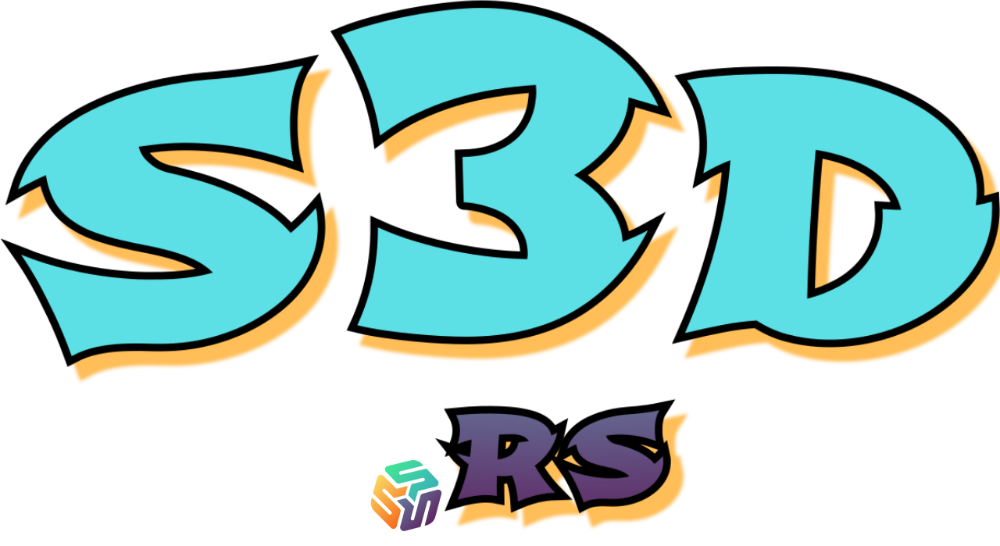

<div id="top"></div>
<div align="center" style="display: block; background-color: black; text-align: center">
  <a alt="s3d logo" href="https://s3d.rs" style="display: block; background-color: black; text-align: center">
    
  </a>
</div>
<br />
<div align="center">
  <a alt="crate" href="https://crates.io/crates/s3d">
    
  </a>
  <a alt="license" href="LICENSE">
    
  </a>
  <a alt="build" href="https://github.com/s3d-rs/s3d/actions">
    
  </a>
  <!--
  <a alt="releases" href="https://github.com/s3d-rs/s3d/releases/latest">
    
  </a>
  <a alt="s3d at docs.rs" href="http://docs.rs/s3d">
    
  </a>
  
  -->
</div>
<br />

# `s3d` is an S3 daemon for the Edge written in Rust

The _goal_ of `s3d` is to provide a daemon for edge platforms (e.g. factory servers  🏭  planes  🛩  ships  🚢  cars  🏎  laptops  💻  mobile devices  📱  wearables  ⌚  ...) that connect to a central object storage (aka Hub).

Since edge applications operate in subideal environments (high latency network, disconnections, hardware failures, eavesdropping, ...), `s3d` aims to make the applications run smoothly while it handles the flows of data, security, networking, local capacity, metadata caching, write queueing, etc.

Worth mentioning that the choice of the Rust language is a natural fit for the edge systems, as it is a modern language with a focus on functionality, safety and performance. `s3d` builds with the rust toolchain into a single binary that loads a yaml config file, which makes it easy to set up and configure in standalone linux or containerized environments like Kubernetes.

# Info

This project is still  **🛸🛸🛸  Experimental  🚀🚀🚀**

This means it's a great time to affect its direction!

If you find it interesting or want to contribute, please feel free to communicate using these options:

- [Discord Chat](https://discord.gg/kPWHDuCdhh) - join to discussion channels
- [Github Issues](https://github.com/s3d-rs/s3d/issues) - for bugs/questions/disccussions/suggestions
- [Github PR's](https://github.com/s3d-rs/s3d/pulls) - add features/fixes/improvements (prefer to have an issue open first)
- [Github Projects](https://github.com/s3d-rs/s3d/projects) - track roadmap/progress
- [License](https://github.com/s3d-rs/s3d/blob/main/LICENSE) - Apache-2.0

# Docs

- [Commands](docs/commands.md)
- [Config](docs/config.md)
- [Examples](docs/examples.md)

# Quick start

To start using `s3d` you need to install it, run it, and configure your data workflows.

The following steps illustrate a basic flow of s3d usage:

```sh
# Install the s3d binary using Rust toolchain
cargo install s3d

# Sets up the configuration, hub connection, and local storage
s3d init

# Run the daemon to serve S3 clients can connect to read and write objects
# Start and stop will spawn/kill the daemon in the background
s3d run
s3d start
s3d stop

# Fetch reads metadata from the hub and stores locally
# This includes the list of objects and their metadata, but excludes objects contents
s3d fetch [bucket/prefix]

# Pull is like fetch but includes objects contents.
s3d pull [bucket/prefix]

# Simple access to objects from the CLI
s3d get bucket/key > file
s3d put bucket/key < file
s3d ls [bucket/prefix]

# Show local changes not pushed to the hub
s3d diff [bucket/prefix]

# Show bucket status and local store stats (objects, sizes, etc).
s3d status [bucket/prefix]

# Push bucket changes (merge by last modified time).
s3d push [bucket/prefix]

# Remove objects from local store based on age
s3d prune [bucket/prefix]
```

